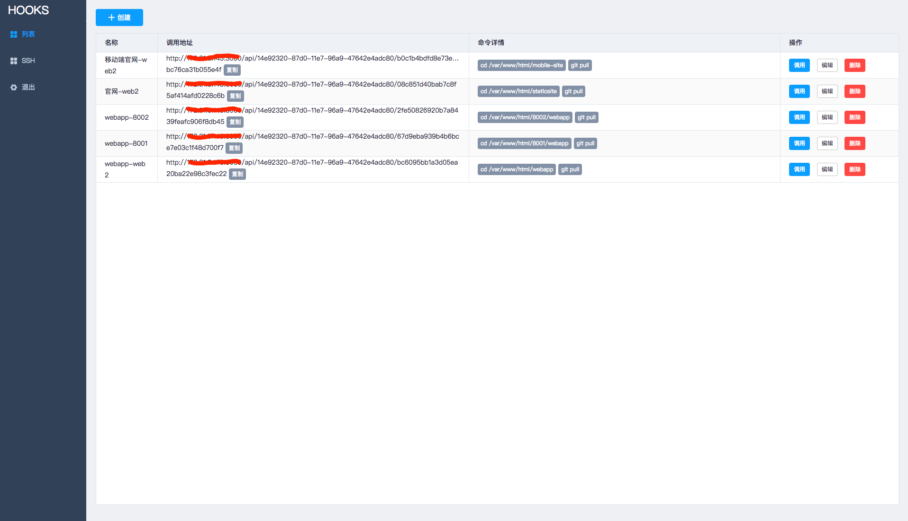
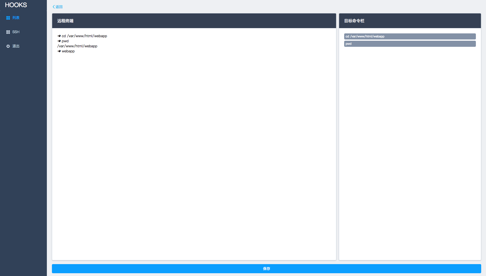
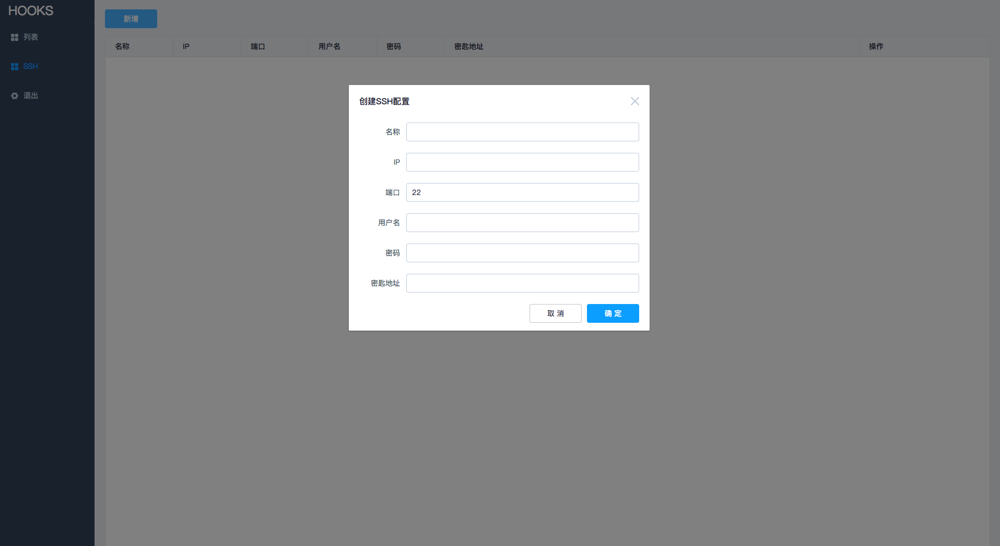
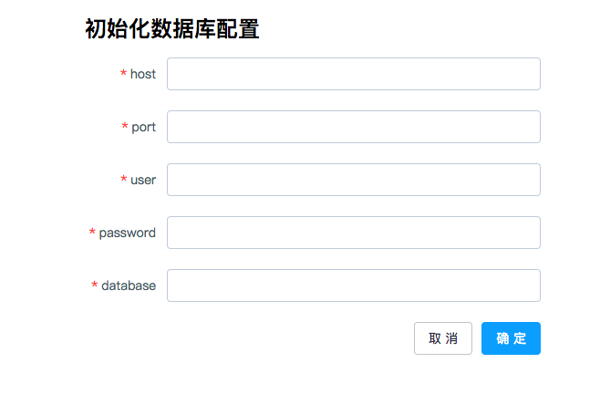

# HOOKS - Pull to refresh for the web
#hooks
> HOOKS is mainly to solve the problem of remote service updates, through the simple configuration in HOOKS, you can call restful  API (post) for remote service operation. And HOOKS support SSH, configure SSH, you can log in to the remote machine terminal to execute the shell script.  
## Dependencies
* nodejs
* mysql
* vue
* yarn
## overview
> Hook list page, in this page you can browse all the hook configuration, and the test call  

> Create a hook page, which is a web page terminal where you can edit the command set of the hook you want to create. The command record can be cleared by the shortcut key **control + k**. You can also delete unnecessary commands on the right side of the command bar.  

> By configuring ssh on the current page, you can use the command **ssh name** to log in to the remote terminal when creating the hook  

## initialization
### STEP 1
Clone or download the project to your server, and then install the packages that the project depends on.After the installation is successful, you can start the service through the node
```
yarn
node bin/www
```

### STEP 2
Create the mysql database, and then initialize the tables by importing the sql file: doc/hooks.sql
### STEP 3
Access the configuration page, the database initialization configuration: http://ip:port/initDb


### STEP 4
Configuration complete! You can log in to the system to enjoy the convenience of Hooks, the default account are :
> userName: admin  
> password: admin  
You can also customize the account name and password in the database